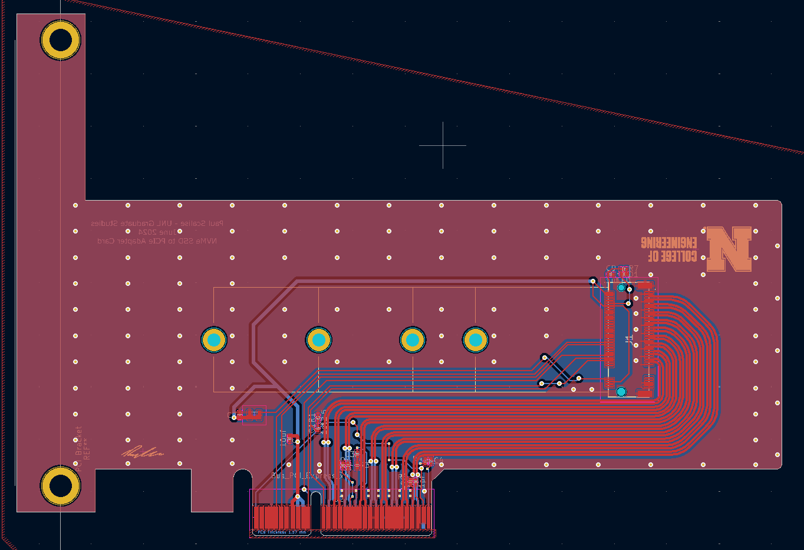
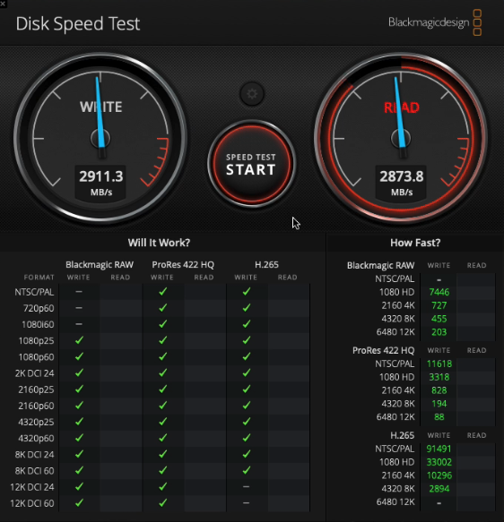

# NVME PCIe Card

A x4 PCIe to NVME adapter card for additional storage in PCIe Gen 4 and below compatable machines.
This board was created for the final project in ECEN 882 Passive Microwave Components at the University of Nebraska-Lincoln.

## PCB Design

## Validation

This board was tested with and on PCIe Gen 3 capable hardware. Read and write speeds top out near the real world limits of the hardware, thus proving at least PCIe Gen 3 performance metrics.

## TODO
Need to add full BOM.